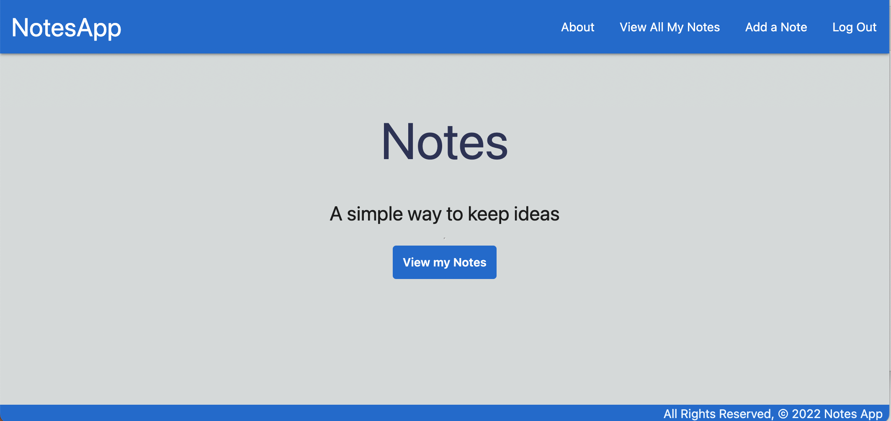
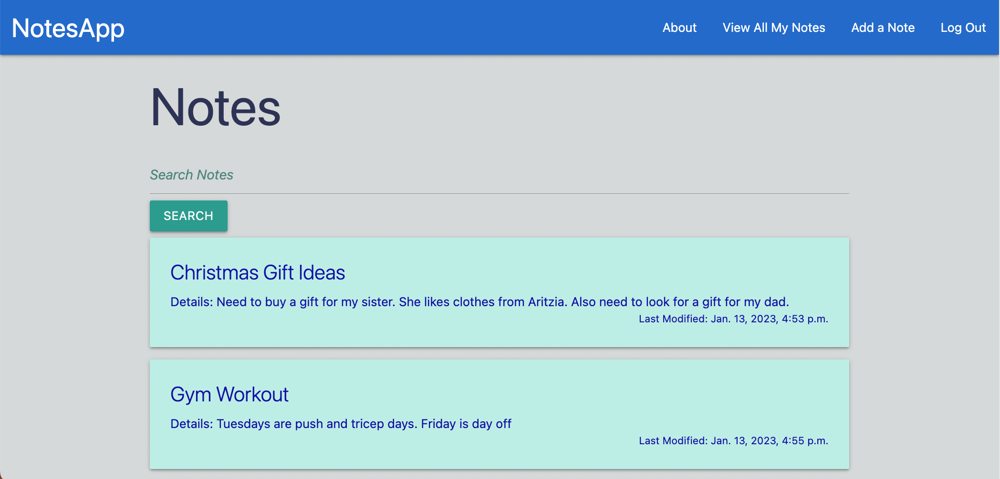
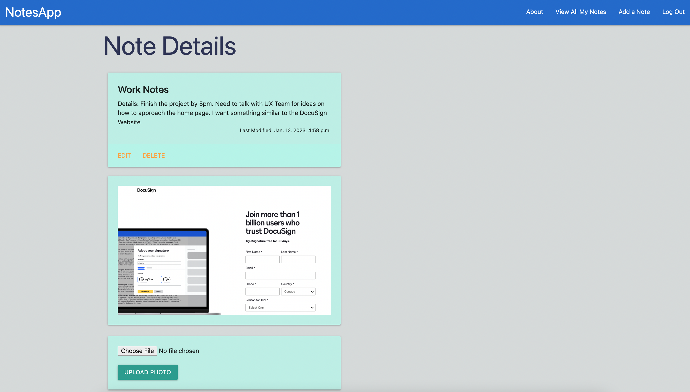

<h1>NotesApp</h1>

NotesApp is a free and simple way to store whatever is on your mind. With NotesApp, you are provided the ability to create, read, edit and delete your notes seamlessly. Need to add pictures to that specific note? NotesApp allows you to upload multiple pictures to your notes quickly and worry-free with the help of AWS. Your notes are secured and safe and only you can view your own personal thoughts and ideas. Start keeping track of your ideas today! 

<h2>Technologies Used</h2>

 
 
 
 
 
 
 
# <h2>Screenshots</h2>

<h2>Getting Started</h2>

<a href="https://trello.com/b/zC3AmA5H/project3">Trello Board</a>

<a href="">NotesApp Application</a>

<h2>Next Steps</h2>

<ul>
  <li>Implement edit and delete photo ability</li>
  <li>Add a checklist feature within the note itself</li>
  <li>Create a Mobile dedicated version</li>
</ul>
